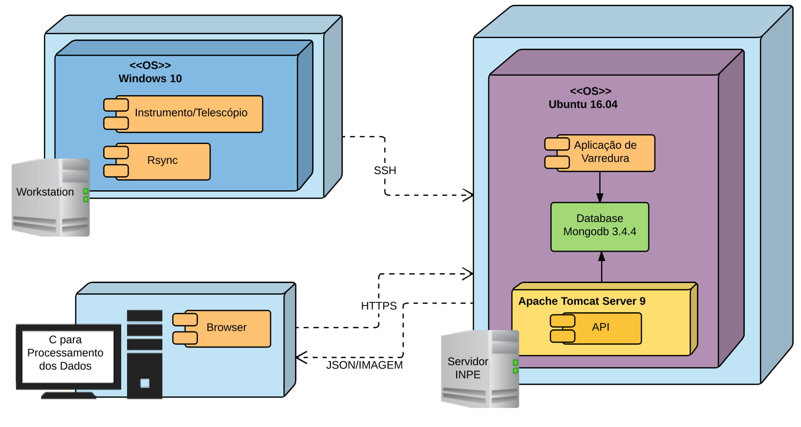

# SIA-CIS - Sistema Integrado de Armazenamento e Consultas das Imagens Solares


Este projeto foi desenvolvido em serviço de estágio no CEA II, [Instituto Nacional de Pesquisas Espaciais](http://www.inpe.br/), e integrado como trabalho de graduação para se obter o título de técnologo pela [FATEC Jessen Vidal de São José dos Campos](http://fatecsjc-prd.azurewebsites.net/).


-----------------------------------------------------------------------------------------


Projeto
-------

Neste trabalho consistiu no desenvolvimento de uma aplicação capaz de extrair, armazenar e disponibilizar os metadados das imagens do tipo FITS geradas por um instrumento de telescópio, em desenvolvimento no CEA II, com o objetivo de estudar o campo magnético do Sol no INPE.


Módulos do Sistema
------------------

O sistema foi dividido em três módulos principais:


1. **MTI - Módulo de Transmissão das Imagens:**  Há um planejamento de que esse instrumento seja colocado em produção no Observatório do Pico dos Dias após o término de seu desenvolvimento. Para transferir as imagens do observátorio para o INPE será usado o software Rsync em conjunto com um script bash para em um dado período de tempo trazer as novas imagens disponíveis.


1. **MADI - Módulo de Armazenamento dos Dados das Imagens:**   Uma aplicação desenvolvido em Java com o framework Spring Data MongoDB para extrair e armazenar os metadados das imagens com extensão FITS. em um banco de dados, definido como sendo o MongoDB, e organizar as imagens em uma estrutura em árvore de pastas. O objetivo dessa aplicação é trabalhar somente com imagens no formato FITS, ou seja, qualquer outro tipo de imagem ele não irá reconhecer e irá tratar como arquivo corrompido. Para mais detalhes sobre esse formato de arquivo, acesse esse [link](https://sites.google.com/site/exoplanetasesdm/formato-de-imagens-fits).


1. **MVDI - Módulo de Visualização dos Dados das Imagens:** Um serviço Web Rest desenvolvido em Java Web e os frameworks do Spring, WebMVC e Data MongoDB,  para consulta e visualização dos metadados das imagens armazenadas no banco de dados, e o download dessas imagens.


Arquitetura do Sistema
----------------------

Logo abaixo, é demonstrado como os módulos se comunicam entre si e com o usuário:


<p align="center">
  
</p>


Testes
------

Se você deseja testar em sua máquina, é necessário configurar quais as pastas que a aplicação irá procurar por novas imagens, organizar e informar quais as imagens já estão salvas no banco de dados, e uma pasta referente ao Log.

Seguindo o caminho `/FITS/MADI/src/main/resources/applicationContext.xml` irá encontrar o arquivo de configuração do Spring. Na linha 27 ao 30 é criado um Bean com dois argumentos do construtor.


```xml
27    <bean id="controller" class="br.inpe.filesystem.MoveImage">
28     	   <constructor-arg name="pathPrincipal" value="/home/inpe/Pictures" />
29         <constructor-arg name="pathDB" value="/home/inpe/Database" />
30    </bean>
```

 Na linha 28 é passado o `pathPrincipal` que é o diretório onde as novas imagens serão trazidas e armazenadas pelo Rsync e na linha 29 é passado o `pathDB` onde ficará as imagens que já tem o seu metadado armazenados no banco de dados. Defina dois diretórios em seu computador/servidor e altere os campos `value` com o seu respectivo caminho. 

* Lembre-se, essa aplicação trata somente imagens no formato FITS, qualquer outro tipo de arquivo nesse diretório será tratado como arquivo corrompido.

 ```xml
28   <constructor-arg name="pathPrincipal" value="/diretorio/para/novas/imagens" />
29   <constructor-arg name="pathDB" value="/diretorio/para/metadados/salvos/no/BD" />
```


Agora é necessário alterar o bean `log`. Ele é usado para verificar se a aplicação foi interrompida durante o processo de salvar os dados no MongoDB ou realocado para a pasta padrão do `pathDB`. Crie um arquivo e na linha 33 no campo `value` coloque o seu caminho.


 ```xml
32	<bean id="log" class="br.inpe.log.Log">
33		<constructor-arg name="path" value="/caminho/para/o/arquivo/log.txt" />
34	</bean>
```


O bean `verify` também é uma parte do Log. Na linha 37, o `pathCorrupted` é reponsável por armazenar as imagens que estiverem corrompidos e na linha 38 é criado um arquivo `log.txt` usado como flag. Defina um diretório para onde as imagens corrompidas serão realocadas e um arquivo de log, assim na linha 39 e 40 coloque os caminhos dos diretórios definido.

* Um dos objetivos futuros é utilizar a biblioteca padrão do Java de Log e descartar toda a classe de log criada, pois contém bugs e é muito complicado de se entender.

* Na linha 39 e 40, deve se colocar os respectivos caminhos definido anteriormente no `pathPrincipal` e `pathDB`.

 ```xml
36	<bean id="verify" class="br.inpe.log.Verify">
37	 <constructor-arg name="pathCorrupted" value="/home/inpe/Corrupted" />
38	 <constructor-arg name="log" value="/home/inpe/Corrupted/log.txt" />
39	 <constructor-arg name="pathPrincipal" value="/home/inpe/Pictures" />
40	 <constructor-arg name="pathDB" value="/home/inpe/Database" />
41	</bean>
```


A aplicação utiliza o MongoDB para armazenar os metadados das imagens. Assim, altere os campos `host`, `port` e `dbname` com as configurações do seu banco de dados.


```xml
	<mongo:db-factory host="localhost" port="27017" dbname="inpe" />
```

Acesse esse [link](https://github.com/RafaMariano/teste/blob/master/ssw_cutout_20110706_020018_AIA_1600_.fts) para baixar uma imagem FITS para teste.
